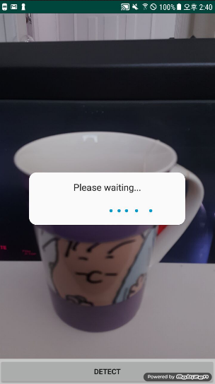
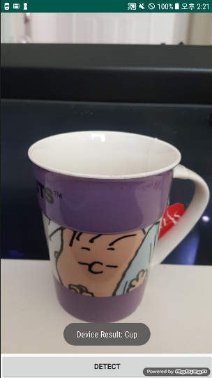

# ImageLabeling_Firebase

## 소개

카메라와 Firebase ML kit를 사용하여 image labeling 안드로이드앱

- 네트워크 환경에서는 클라우드 기반 API인 Google Cloud Platform의 강력한 머신러닝 기술을 활용하여 보다 높은 정확성을 제공합니다.
- 오프라인 환경에서는 기기별 API를 사용하여 데이터를 빠르게 처리하고 네트워크 연결 없이도 작동하게 하는 장점이 있습니다.

## 사용 기술

- Android(Kotlin)
- ML kit SDK
    - Google Cloud Vision API
    - 기기별 Image Labeling API

## 앱 이미지

<네트워크 환경에서의 Image Labeling>

<오프라인 환경에서의 Image Labeling>

---

## 보완할 점 & 추가 기능

- Firebase 무료 요금제 사용중이라, Google Cloud Platform 기능 사용이 불가해 네트워크 환경에서의 Image Labeling 어려움 → 차후에 업그레이드 후 확인할 것
- 로컬 이미지 로딩하여 Image Labeling 기능 추가